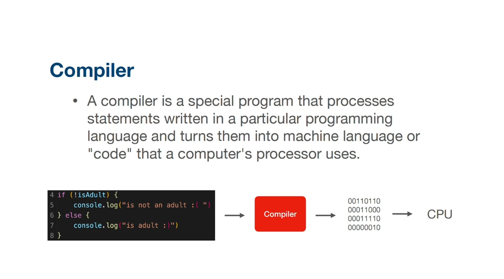
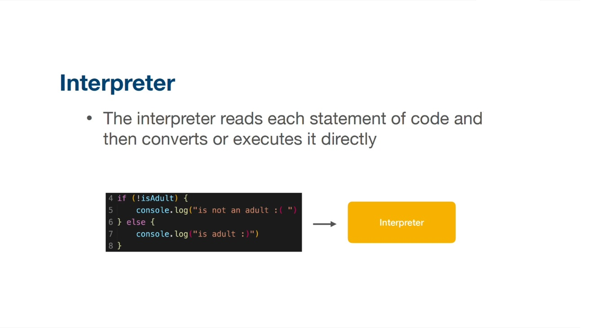

Here are **concise summary notes** based on the content you shared:

---

## Compiled vs Interpreted Languages

### Programming Languages (Overview)

* Programming languages are used to communicate instructions to computers.
* They help control machine behavior and express algorithms.
* Common languages include **Java, Golang, C++, and JavaScript**.
* Each language has unique syntax, features, and use cases.
* Language choice depends on project requirements.

---

## Compiled Languages

* Code is **translated into machine code before execution**.
* Produces an executable file or platform-specific machine code.
* **Faster execution** since compilation happens only once.
* Stricter syntax and semantics → **more reliable and efficient code**.
* Errors are usually caught **at compile time**, making debugging harder.
* Less portable across platforms unless recompiled.
* Examples: **C, C++, Go**
* Some languages like **Java** use compilation (to bytecode) and interpretation/JIT.

---

## Interpreted Languages

* Code is **executed line-by-line by an interpreter**.
* No direct conversion to machine code beforehand.
* **Easier to learn and use** (high-level, human-readable).
* **More portable** across platforms with an available interpreter.
* Slower performance due to interpretation at runtime.
* Debugging can be challenging due to interpretation layer.
* Examples: **Python, JavaScript, Ruby**

---

## Key Differences (Quick Comparison)

| Feature         | Compiled           | Interpreted          |
| --------------- | ------------------ | -------------------- |
| Execution       | After compilation  | Line-by-line         |
| Speed           | Faster             | Slower               |
| Error Detection | Compile-time       | Runtime              |
| Portability     | Platform-dependent | Platform-independent |
| Ease of Use     | Harder             | Easier               |

---

## Conclusion

* **Compiled languages** are best for performance-critical and system-level software.
* **Interpreted languages** are ideal for rapid development, scripting, and portability.
* Some modern languages combine both approaches for optimal performance.

---

If you want, I can also convert this into **exam-ready notes**, **one-page revision sheet**, or **comparison diagram** 🙂
