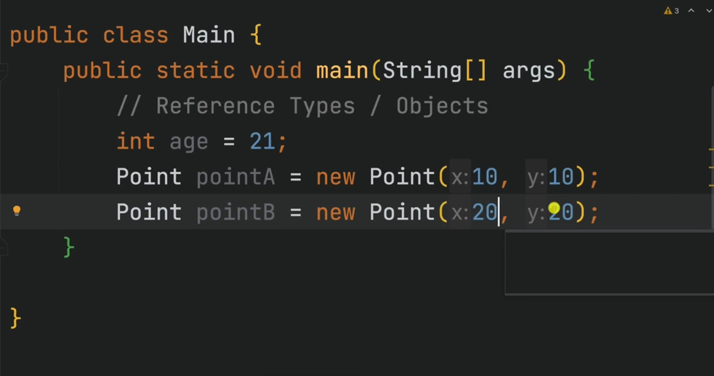

---

### Stack Memory

* Stack Memory in Java is used for static memory allocation and the execution of a thread.
* LIFO - Last In First Out

---

### Frame

* A stack frame contains all the data for one function call.
* The stack frame only exists during the execution time of a function including any refrences.

---
 
### Heap

* Space is used to store objects and JRE classes at runtime.
* New objects are always created in heap space.
* References to these objects are stored in stack memory.

---

---

